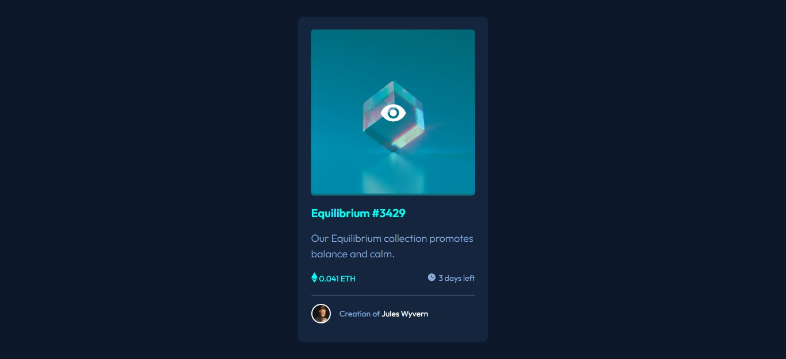

# Frontend Mentor - NFT preview card component solution

This is a solution to the [NFT preview card component challenge on Frontend Mentor](https://www.frontendmentor.io/challenges/nft-preview-card-component-SbdUL_w0U). Frontend Mentor challenges help you improve your coding skills by building realistic projects. 

## Table of contents

- [Overview](#overview)
  - [The challenge](#the-challenge)
  - [Screenshot](#screenshot)
  - [Links](#links)
- [My process](#my-process)
  - [Built with](#built-with)
  - [What I learned](#what-i-learned)
  - [Useful resources](#useful-resources)
- [Author](#author)

## Overview

### The challenge

Users should be able to:

- View the optimal layout depending on their device's screen size
- See hover states for interactive elements

### Screenshot

### Links

- Solution URL: [solution URL here](https://github.com/Bouyyah/NFT-Preview-card)
- Live Site URL: [live site URL here](https://bouyyah.github.io/NFT-Preview-card/)

## My process

### Built with

- Semantic HTML5 markup
- SCSS custom properties
- Flexbox
- SASS partials
- SASS variables
- Mobile-first workflow

### What I learned

In this project there was more play with images and Hover effect, wich gives more focus to the layout and how we should structure our elements to interact with each other.

### Useful resources

- [MDN web docs](https://developer.mozilla.org/en-US/docs/Learn/CSS/Howto/Make_box_transparent) - This helped me for for the transparent background to change the image on hover. I really liked this pattern and will use it going forward.
- [W3schools](https://www.w3schools.com/howto/howto_css_display_element_hover.asp) - This is an article which helped me finally understand diplay property to use it to hide elements on hover. I'd recommend it to anyone still learning this concept.

## Author

- Github - [@Bouyyah](https://github.com/Bouyyah)
- Frontend Mentor - [@Bouyyah](https://www.frontendmentor.io/profile/Bouyyah)
- LinkedIn - [@Bouyyah](https://www.linkedin.com/in/bouyyah/)

